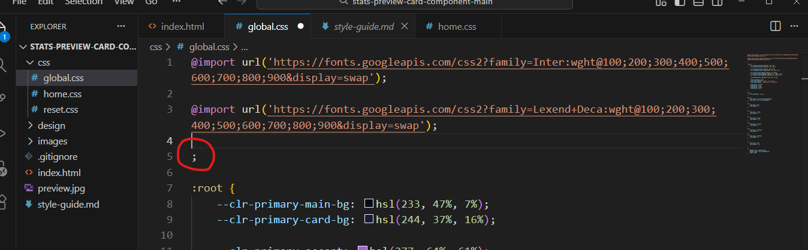

# Frontend Mentor - Single price grid component solution

This is a solution to the [Stats preview card component challenge on Frontend Mentor](https://www.frontendmentor.io/challenges/single-price-grid-component-5ce41129d0ff452fec5abbbc). Frontend Mentor challenges help you improve your coding skills by building realistic projects. 

## Table of contents

- [Overview](#overview)
  - [The challenge](#the-challenge)
  - [Screenshot](#screenshot)
  - [Links](#links)
- [My process](#my-process)
  - [Built with](#built-with)
  - [What I learned](#what-i-learned)
  - [Continued development](#continued-development)
- [Author](#DexterOhaeri)

## Overview

### The challenge

Users should be able to:

- View the optimal layout for the component depending on their device's screen size
- See a hover state on desktop for the Sign Up call-to-action

### Screenshot

 

### Links

- Solution URL: [Solution URL](https://github.com/MrDexterO/FrontEndMentorsChallenge-stats-preview-card-component-solution)
- Live Site URL: [Live site](https://mrdextero.github.io/FrontEndMentorsChallenge-stats-preview-card-component-solution/)

## My process

### Built with

- Semantic HTML5 markup
- CSS3
- CSS custom properties
- Flexbox
- CSS Grid

### What I learned

I have learned a lot from this challenge. From how I need to be extra careful when writing my markups, as one comma or semi colon can throw a whole project off balance, to why it is importance to have a "mobile-first" mindset when designing a website due to responsiveness.

The first issue was a tiny orphan semi-colon that made most of my codes not responding. Inspections could not save me as it identified nothing. Until an act of GOD that drew my attention to that matter.  

Other lessons are as follows:
1. Inline elements will never respond to padding unless the display property is changed from `block`, `inline-block` or `inline-flex`

2. The importance of `flex-grow` and `flex-basis` in using `flex`.

3. The flexibility of `grid` when compared to flex for responsiveness.

### Continued development

In future projects, I will continue to work on mastering the flex-grow and flex-basis properties and also put more effort into `grid`..

## Author

<!-- - Website - [Dexter Ohaeri](https://www.your-site.com) -->
- Frontend Mentor - [@MrDexterO](https://www.frontendmentor.io/profile/MrDexterO)
- GitHub - [@MrDexterO](https://github.com/MrDexterO)

## Acknowledgments

I acknowledge [coding2go](https://coding2go.com/) youtube channel. I went there to seek help understanding grid when I got stuck.

